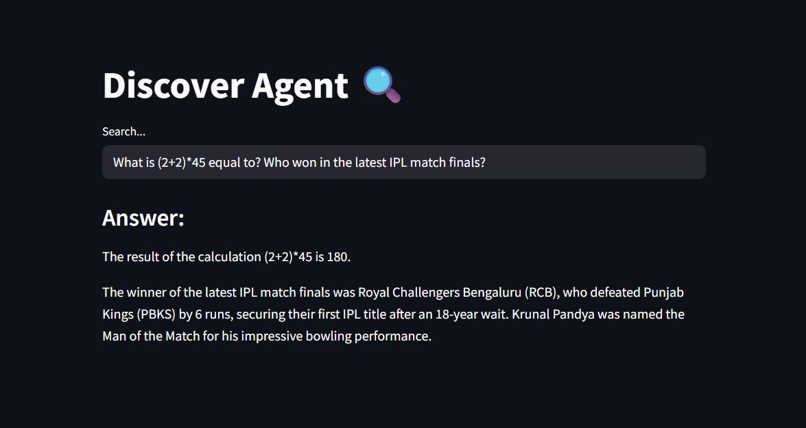

# 🔎 Discover Agent

Discover Agent is an AI-powered web search application that utilizes **LangGraph Agents**, **DuckDuckGo** search, and Groq-hosted **Qwen3-32b** to dynamically fetch and synthesize information. Unlike traditional workflows, this project dynamically decides when, how and whether to use tools during execution, showcasing the power of autonomous **AI agents** in navigating uncertain tasks.



---

## 🚀 Project Overview

This project creates a **Discover Agent** that:

* Accepts natural language queries via a web UI,
* Uses Qwen3-32b (hosted on Groq) as the reasoning LLM,
* Employs tools such as:
  * DuckDuckGo Search for real-time web lookup, 
  * Datetime tool to fetch current date/time if needed,
* Routes the conversation intelligently via LangGraph,
* Displays real-time, concise answers.

## ✨ Features

* 🌐 Real-time Web Search (DuckDuckGo)
* 🕓 Current Date & Time Tool
* 🧭 qwen/qwen3-32b via Groq for planning and response generation
* 🧱 LangGraph Agent with tool invocation and conditional logic
* 🔄 Stateful and flexible architecture
* 🖥️ Streamlit-based user interface
* ⚡ FastAPI backend

---

## 🧠 What is an AI Agent?

An **AI Agent** is a self-directed system that:

* Interprets complex input (e.g., human questions),
* Perceives its environment (e.g., user queries and tools),
* Decides what actions (e.g., tools to use) to take independently,
* Acts autonomously (e.g., fetches and processes information),
* And adapts based on feedback or reasoning loops.

LangGraph provides a framework to build these agents with dynamic, branching logic and persistent memory, surpassing traditional workflows. LangGraph agents go beyond static workflows by supporting conditional branching, autonomous tool use decisions, and persistent state handling.

## 🔄 LangGraph vs. LangChain: Why LangGraph?

| Feature             | LangGraph                                | LangChain (Core)                    |
| ------------------- | ---------------------------------------- | ----------------------------------- |
| Execution Model     | **Graph-based execution**                | Linear or chain-of-tools            |
| Tool Decision Logic | Built-in conditional routing (agents)    | Requires manual logic or chains     |
| State Persistence   | **Explicit state tracking**              | Implicit through variables          |
| Flexibility         | Better for **multi-step, dynamic logic** | Suitable for **simple tool chains** |

**LangGraph** is ideal when you need an agent that decides *when* to use a tool and *how* to proceed after tool output—like in this project.

## 🧠 Discover Agent vs. Discover (Workflow)

Here is a [link](https://github.com/harshith-77/discover) to the previous version "Discover" for your reference

| Feature             | Discover Agent (LangGraph)                | Discover Workflow (Earlier Version)    |
| ------------------- | ----------------------------------------- | -------------------------------------- |
| Tool Decision       | Dynamic & Conditional                     | Predefined Steps                       |
| Extensibility       | Easy to plug in new tools / logic         | Hardcoded path                         |
| Autonomy            | Agent decides next step                   | Linear, no adaptive logic              |
| Complexity Handling | Better for multi-turn or tool-heavy tasks | Suitable for simple single-step tasks  |
| Maintenance         | Modular and easier to extend              | Less flexible, more code change needed |

**Drawbacks of agent-based approach:**

* Slightly more overhead to set up initially
* Graph logic can be overkill for very simple tasks

---

## ⚙️ Installation

### 1. Clone the repository

```bash
git clone https://github.com/harshith-77/discover-agent.git
cd discover-agent
```

### 2. Install dependencies

```bash
pip install -r requirements.txt
```

### 3. Set up environment variables

Create a `.env` file with:

```
GEMINI_API_KEY=your_google_genai_key
```

## ▶️ Run the App

### Start the FastAPI backend:

```bash
python main.py
```

### Launch the Streamlit UI:

```bash
streamlit run main_ui.py
```

## 🧰 Tech Stack

| Layer       | Technology                                 |
| ----------- |--------------------------------------------|
| LLM         | Qwen3-32b via Groq API |
| Agent       | LangGraph                                  |
| Tool        | DuckDuckGoSearchRun, Custom Datetime Tool  |
| UI          | Streamlit                                  |
| Backend     | FastAPI + Uvicorn                          |
| Env Manager | python-dotenv                              |

---

## 📁 File Structure

```
├── main.py           # FastAPI backend
├── main_ui.py        # Streamlit UI
├── helper.py         # Agent logic with LangGraph
├── .env              # API keys (not checked into git)
├── requirements.txt  # Python dependencies
```

## 🗣 Example Usage

1. Open the Streamlit app.
2. Type a query like:
   **"Who won the IPL 2025 final?"**
3. The agent provides a concise response to the query by fetching from web if needed.

---

## 📜 License

MIT License
